# Young-board-server 
lightweight one-stop big data analysis platform
The project was launched on June 17, 2022 and is under continuous updating.

## Complete development and use documents
[introduction to development and use of details](https://board.zhisida.com/docs/share/162f64f8-bc27-41c1-818c-57f6a953fab1)

## Introduction
  Rapid collection and cleaning, task management, real-time flow and batch data analysis, data visualization, rapid data template development, ETL tool set, data science, etc. It is a lightweight one-stop big data platform. Help users quickly build a CDP customer data platform to realize data analysis, user behavior analysis, user label portrait and online marketing on the mobile terminal. It is perfectly compatible with Shence embedded point SDK, Youmeng embedded point SDK and other terminal embedded point packages. Rapid docking and application.
- Front end address: [gitee](https://gitee.com/young-pastor/Young-Board-Vue) [Github](https://github.com/young-pastor/Young-Board-Vue)
- Back end address: [gitee](https://gitee.com/young-pastor/Young-Board-Server) [Github](https://github.com/young-pastor/Young-Board-Server)

### Technology stack
#### Storage
- Distributed storage: HDFS, HBase
- Line relational storage: MySQL, Oracle
- Columnar storage: Clickhouse
- Column family storage: HBase, Cassandra
- Document library: elasticsearch, mongodb

#### Calculation
- Computing engine: Presto, hive
- Stream processing: storm, Flink

#### Integration:
- Flume
- Filebeat
- Logstash
#### Front end technology stack
- Vue
- Element UI
#### Back end technology stack
- Spring Boot
- Spring Cloud
- MyBatis
### Project description
#### Main contents of the project
- Log collection(flume+kafka)
- Log warehousing(flink+hdfs)
#### Workflow
Complete the construction of data collection technology and business design, complete the embedded point of user behavior data collection with the cooperation of app and applet system suppliers, and build online user behavior labels and portraits based on the embedded point data.
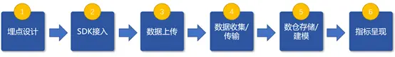
#### Architecture design ideas
The so-called "buried point" is a term in the field of data collection(especially in the field of user behavior data collection), which refers to the relevant technologies and their implementation processes for capturing, processing and sending specific user behaviors or events. For example, the number of clicks on an icon, the duration of watching a video, and so on.

#### Business design ideas
For the design of buried point business, first of all, it is necessary to clarify the target behavior of collection according to the business analysis, and further understand where and what kind of points should be buried. During the process, it is recommended to use the "event model" to describe various behaviors of users. The event model includes two core entities: event and user.
Describing user behavior based on 4w1h model can clearly describe the whole behavior. The key points include: who, when, where, in what way and what. By combining these two entities, user behavior can be clearly described.

#### Technical architecture
SDK embedded point collection behavior data source terminals include IOS, Android, web, H5, wechat applet, etc. Different terminal SDKs adopt SDKs of corresponding platforms and mainstream languages. The data collected by the embedded point is submitted to the server API through JSON data in the form of HTTP post.
The server API consists of a data access system. Nginx is used to receive the data sent through the API and write it to the log file. Use nginx for high reliability and scalability.
For the log printed by nginx to the file, the source module of flume will read the nginx log in real time, and the channel module will process the data. Finally, the sink module will publish the processing results to Kafka.
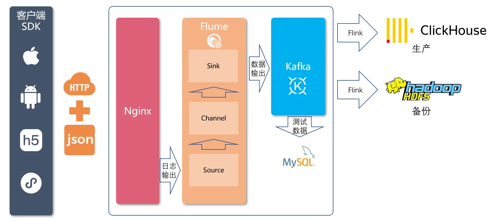
#### Complete software architecture
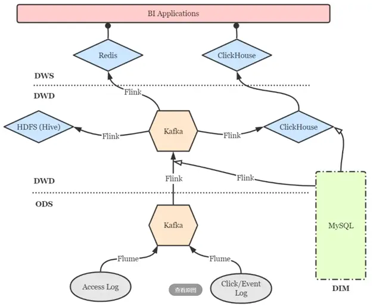
#### Integration steps of third-party embedded point SDK
- Import SDK: add SDK dependencies to the terminal application configuration file. Different terminal import methods will vary. The specific operation steps will be reflected in the subsequent SDK technical documents.
- Configure the reporting server API address: used to set the server address of the SDK reporting API.
- Enable full burial point: the SDK can automatically collect some user behaviors, such as app startup, exit, page browsing, and control clicking. When initializing the SDK, you can configure to open the full buried point through the initialization method provided by the SDK.
#### API access service design
Embedded point data from different channels is sent to the service API through HTTP API to realize data access.
Use nginx as a web container to receive the data sent by the client SDK and write it to the log file. Using nginx mainly takes into account its high concurrency, high reliability and high scalability.
#### User behavior collection scenario
Through the sorting of application scenarios, the burying points can be planned by scenarios and verified by scenarios. Scene sorting can be abstracted into three levels:
- Common basic scenario: unified consideration of common operations
- Important operation scenarios: overall attribution of important operations
- Business mainstream scenario: define the complete process by business line
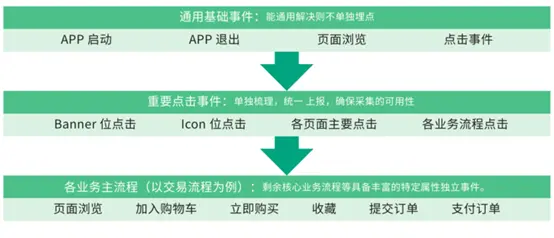
#### Application effect

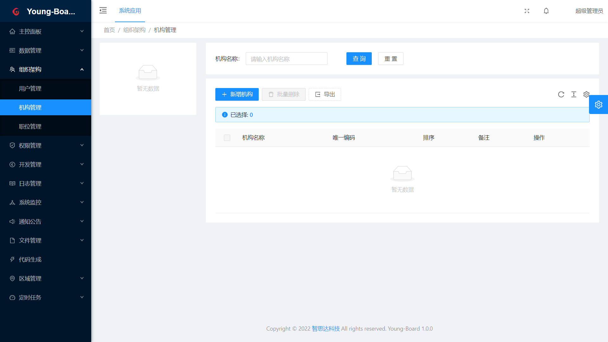

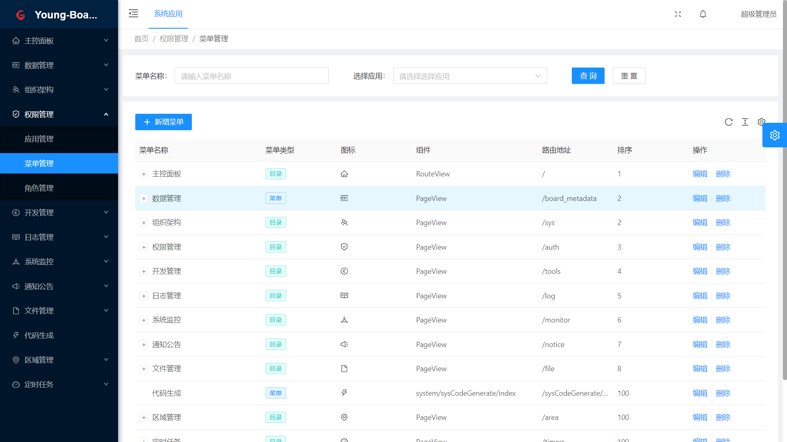

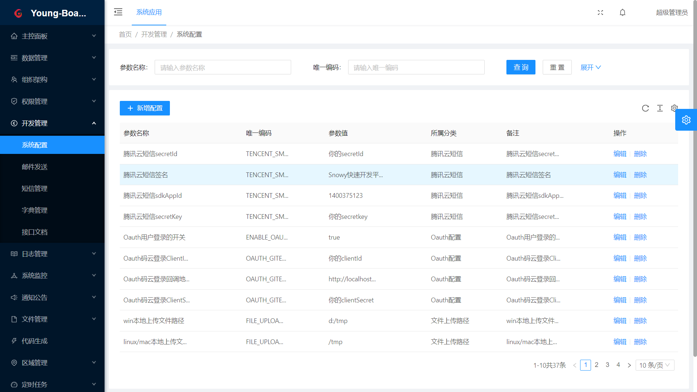

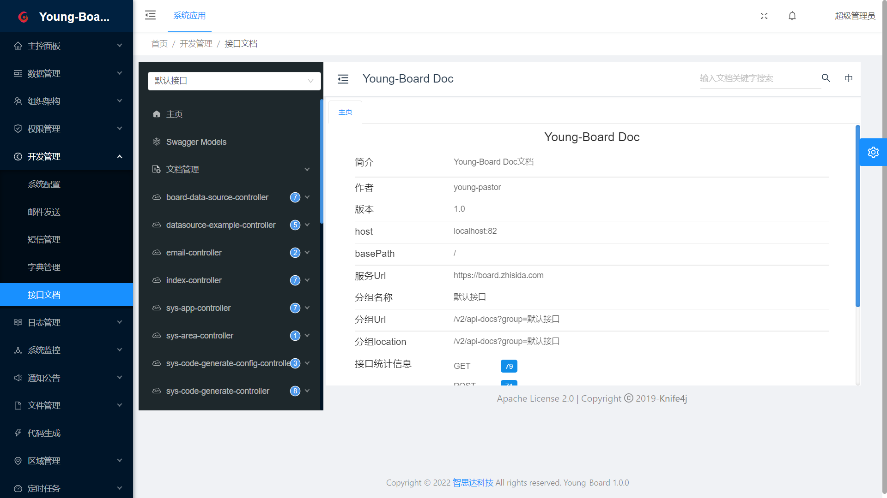

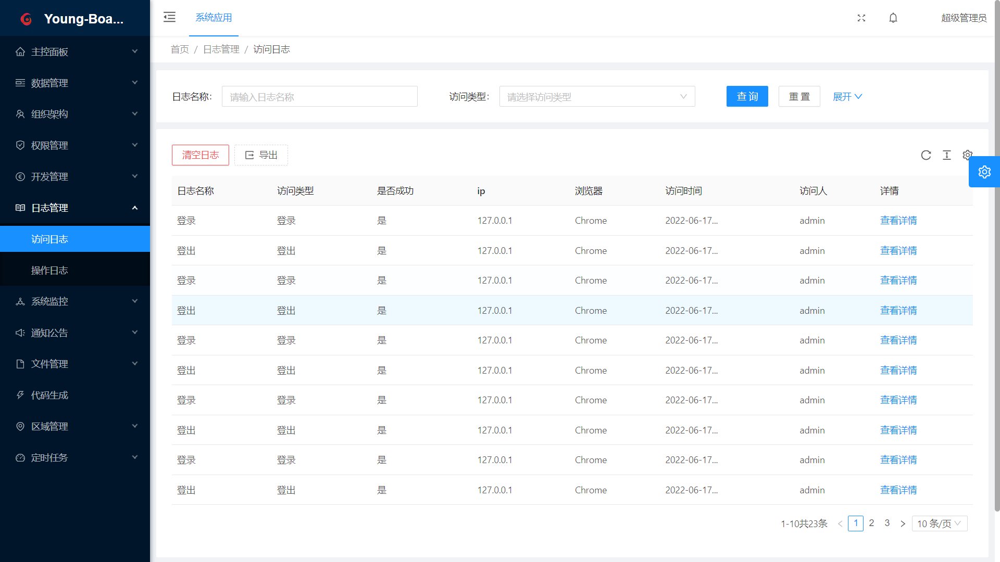

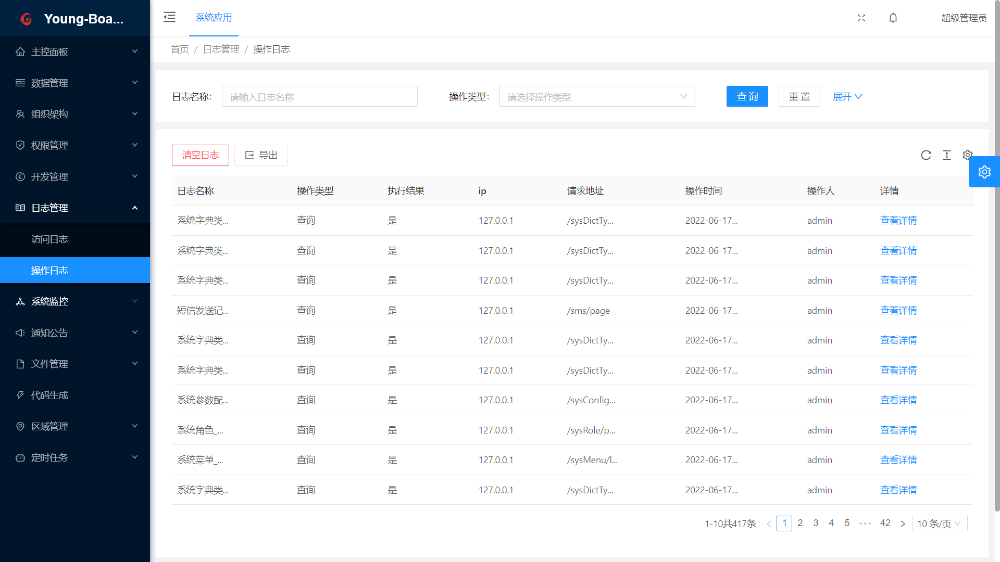

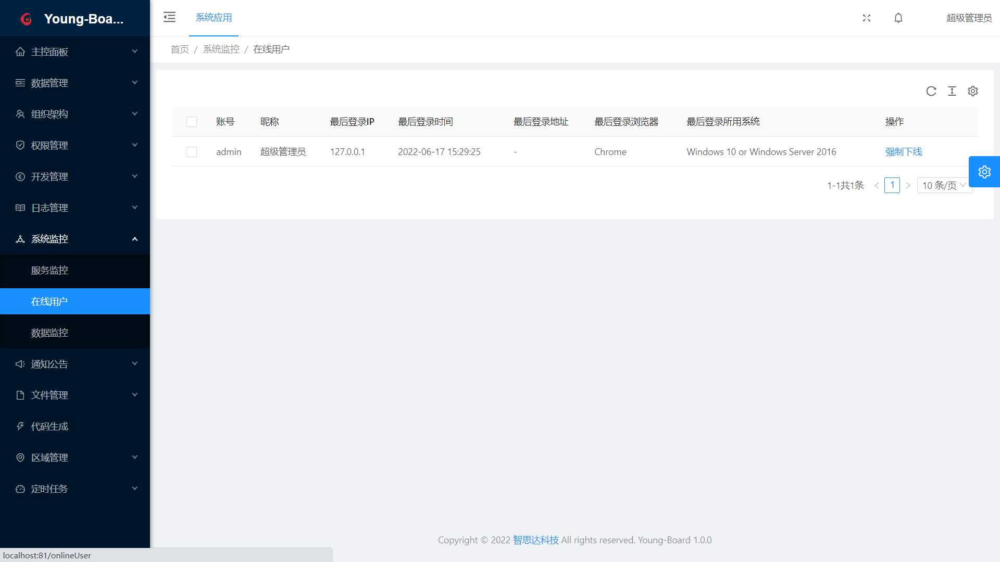

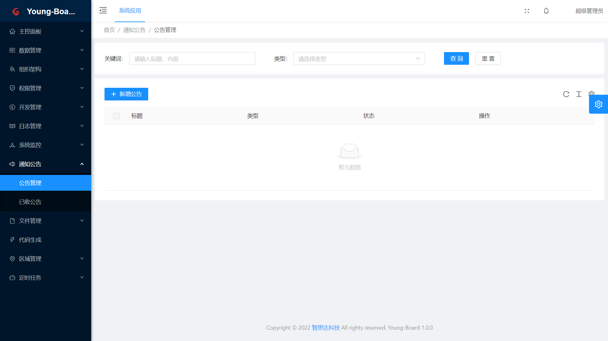

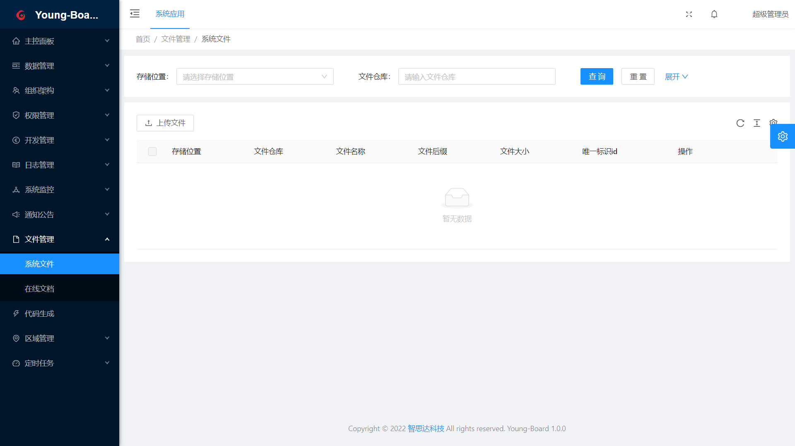

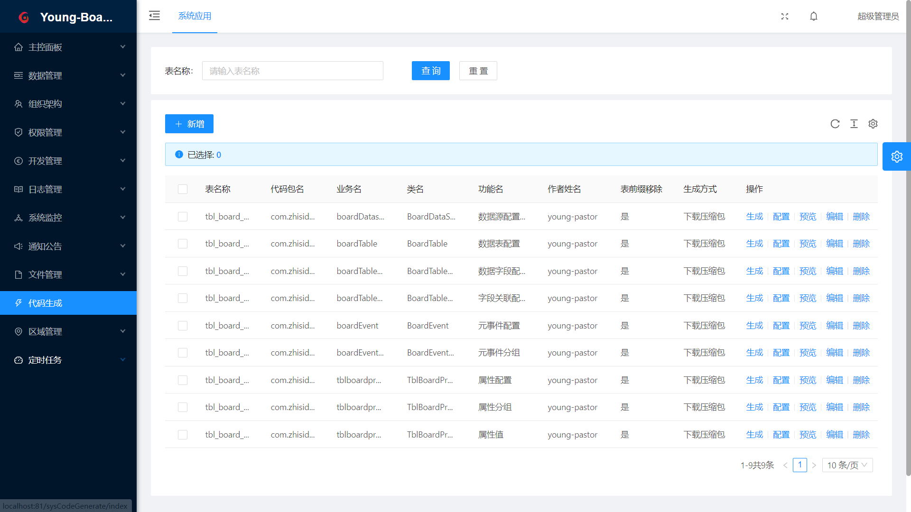

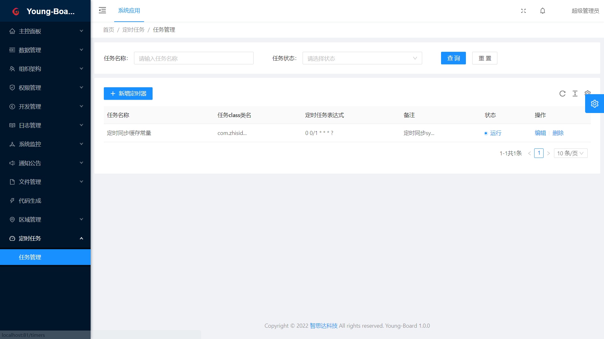

#### Copyright notice

Apache2.0 open source protocol for data behavior analysis of small elephants

Individuals and enterprises, for direct use and commercial use after secondary development, need to comply with:

Including xiaoxianganalysis license documents(authorized users use Xiaoxiang analysis patents and intellectual property rights for free)

If the code is modified, it needs to be explained in the modified file

The modified code and the code derived from the source code need to bear the agreement and trademark in the original code

If multiple open source software is used in the products released commercially after secondary development, a notice file must be included, and xiaoxianganalysis license must be included in the notice file. You can add your own license in the notice, but it cannot be represented as a change to xiaoxianganalysis license.

If you need commercial value-added services, please add wechat communication.

#### Who is using

We hope your logo will appear here. Please click here [issue to register](https://gitee.com/young-pastor/Young-Board-Server/issues), we will give priority to technical support

#### Donation support
If you feel that our open source project Xiaoxiang data behavior analysis is helpful to you, please invite the project developers to have a cup of tea!Currently, we accept donations from wechat, Alipay or code cloud. Please note your nickname or postscript when donating.
Your donation will be used to pay some expenses of the project, and encourage developers to better promote the development of the project. At the same time, you are welcome to donate public servers to improve the online demonstration system experience.

| ||
|---|---|

#### Long term donation

If you are the operator of the enterprise and have plans to use the behavior analysis of Xiaoxiang data in the company's operating products, you are welcome to make a long-term donation. The commercial benefits of long-term donation include:

- Positive response, rapid maintenance and timely update;

- The enterprise name, logo and official website link will be displayed in the open source warehouse, Xiaoxiang smart official website and publicity materials for a long time;

- The donation amount shall be deducted in the same proportion from the price of paid products for the future data behavior analysis of small elephants.

If you are interested in sponsoring the small elephant smart team for a long time, or have other good ideas, please contact the development team on wechat my0o0heart, or send an email to young@zhisida.com。