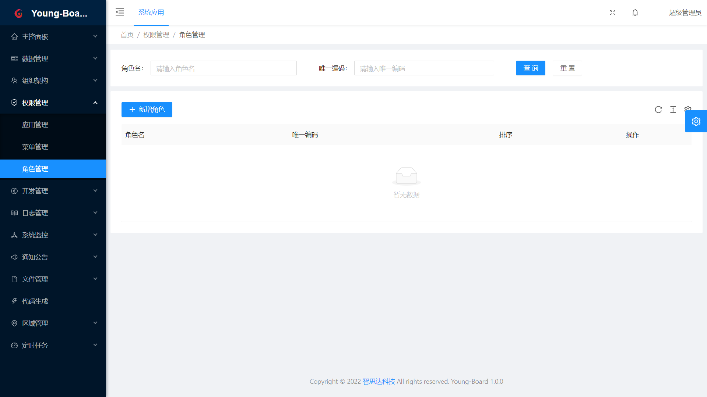

# Young-Board-Server 轻量级一站式大数据分析平台

项目启动于2022-06-17，持续更新中。

## 完整开发使用文档
[详情开发使用介绍](https://board.zhisida.com/docs/share/162f64f8-bc27-41c1-818c-57f6a953fab1)

## 介绍
快速采集清洗，任务管理，实时流和批处理数据分析，数据可视化展现，快速数据模板开发，ETL工具集、数据科学等。是轻量级的一站式的大数据平台。帮用户快速搭建CDP客户数据平台，实现对移动端数据分析、用户行为分析、用户标签画像和在线营销。完美兼容神策埋点SDK、友盟埋点SDK和其他终端埋点包。快速对接、快速应用。

- 前端地址：[Gitee](https://gitee.com/young-pastor/Young-Board-Vue) [Github](https://github.com/young-pastor/Young-Board-Vue)
- 后端地址：[Gitee](https://gitee.com/young-pastor/Young-Board-Server) [Github](https://github.com/young-pastor/Young-Board-Server)

### 技术栈

#### 存储

- 分布式存储：HDFS、HBase
- 行式关系存储：MySQL、Oracle
- 列式存储：ClickHouse
- 列族存储：HBase、Cassandra
- 文档库：ElasticSearch、MongoDB

#### 计算

- 计算引擎：Presto、Hive
- 流处理：Storm、Flink

#### 集成：

- Flume
- Filebeat
- Logstash

#### 前端技术栈

- Vue
- Element UI

#### 后端技术栈

- Spring Boot
- Spring Cloud
- MyBatis

### 工程说明

#### 项目主要内容
- 日志采集（Flume+kafka）
- 日志入库（Flink+HDFS）

#### 工作流程
完成数据采集技术构建和业务设计，在App、小程序的系统供应商配合下完成用户行为数据采集埋点，并基于埋点的数据构建线上用户行为标签和画像。
 

#### 架构设计思路
所谓“埋点”，是数据采集领域（尤其是用户行为数据采集领域）的术语，指的是针对特定用户行为或事件进行捕获、处理和发送的相关技术及其实施过程。比如用户某个icon点击次数、观看某个视频的时长等等。

 

#### 业务设计思路
埋点业务设计，首先需要根据业务分析明确采集的目标行为，进一步搞清楚应该在哪些地方埋什么样的点。过程中建议使用“事件模型(Event 模型）”来描述用户的各种行为，事件模型包括事件(Event)和用户(User)两个核心实体。
基于4W1H模型描述用户行为可将整个行为描述清楚，要点包括：是谁、什么时间、什么地点、以什么方式、干了什么。通过这两个实体结合在一起就可以清晰地描述清楚用户行为。

 
#### 技术架构
SDK埋点采集行为数据来源终端包括iOS、安卓、Web、H5、微信小程序等。不同终端SDK采用对应平台和主流语言的SDK，埋点采集到的数据通过JSON数据以HTTP POST方式提交到服务端API。
服务端API由数据接入系统组成，采用Nginx来接收通过 API 发送的数据，并且将之写到日志文件上。使用Nginx实现高可靠性与高可扩展性。
对于Nginx打印到文件的日志，会由Flume的 Source 模块来实时读取Nginx日志，并由Channel模块进行数据处理，最终通过Sink模块将处理结果发布到 Kafka中。

#### 软件完整架构

#### 第三方埋点SDK集成步骤
- 引入SDK：在终端应用配置文件添加 SDK 依赖，不同终端引入方式会有差异，具体操作步骤将在后续SDK技术文档中体现。
- 配置上报服务端API地址：用于设置SDK上报API的服务端地址。
- 开启全埋点：SDK 可以自动采集一些用户行为，如 App 启动、退出、浏览页面、控件点击。初始化 SDK 时，通过SDK提供的初始化方法可以配置开启全埋点。

#### API接入服务设计
不同渠道的埋点数据通过 HTTP API 发送给服务端API实现数据接入。
采用Nginx作为WEB容器接收客户端SDK发送的数据，并且将之写到日志文件上。使用 Nginx 主要是考虑到其高并发、高可靠性与高可扩展性。 

#### 用户行为采集场景
通过应用场景梳理，实现以场景规划埋点，用场景检验埋点。场景梳理可以抽象为三个层面：
- 通用基础场景：共性操作统一考虑
- 重要操作场景：重要操作整体归因
- 业务主流程场景：以业务线定义完整过程

#### 应用效果

#### 版权声明
小象数据行为分析用Apache2.0开源协议
个人和企业，在直接使用、二次开发后商业使用，需要遵守：

包含xiaoxianganalysis LICENSE文件（授权使用者免费使用小象分析专利和知识产权）
如果修改了代码，需要在被修改的文件中说明
在修改和有源代码衍生的代码中，需要带有原来代码中的协议，商标
在二次开发后商业发布的产品中，使用了多个开源软件，则必须包含一个Notice文件，在Notice文件中需要带有xiaoxianganalysis LICENSE。你可以在Notice中增加自己的许可，但不可以表现为对xiaoxianganalysis LICENSE构成更改。
如果您需要商业化增值服务，请加微信沟通。

#### 谁在使用
希望你们的logo出现在此，请点此[Issue进行登记](https://gitee.com/young-pastor/Young-Board-Server/issues)，我们将优先进行技术支持

#### 捐赠支持
如果您觉得我们的开源项目 小象数据行为分析 对您有帮助，那就请项目开发者们来一杯喜茶吧！当前我们接受来自于微信、支付宝或者码云的捐赠，请在捐赠时备注自己的昵称或附言。

您的捐赠将用于支付该项目的一些费用支出，并激励开发者们以便更好的推动项目的发展，同时欢迎捐赠公网服务器用于提高在线演示系统体验。
|| |
|---|---|

#### 长期捐赠
如果您是企业的经营者并且有计划将 小象数据行为分析 用在公司的经营产品中，欢迎进行长期捐赠。长期捐赠有商业上的益处有：

- 积极响应，快速维护，及时更新；
- 企业名称、Logo 及官网链接将长期展示在开源仓库、小象智慧 官网及宣发材料中；
- 捐赠金额同比例抵扣未来 小象数据行为分析 的付费产品价格。

如果您对长期赞助 小象智慧 团队感兴趣，或者有其他好想法，欢迎联系开发团队微信 my0o0heart，或发送邮件到 young@zhisida.com。
